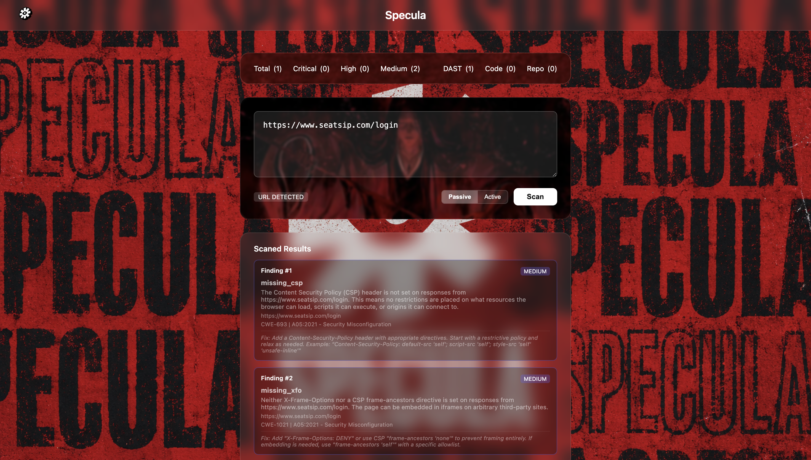

# 🔒 Specula — HORUS Security Scanner

[](https://github.com/yourusername/specula/releases)
[](LICENSE)
[](https://nodejs.org/)
[](https://python.org/)
[](backend/gateway/__tests__)
[](docker-compose.yml)
[](#security)
[](CONTRIBUTING.md)

> **A locally‑trained, production‑hardened security platform** combining network intrusion detection, source‑code vulnerability scanning, and dynamic application security testing — all under one confidence‑based triage engine.

**Now with enhanced security**: All 18 findings from a comprehensive rate‑limiting and vulnerability audit have been patched.

---

## 📦 Features

- **🛡️ Network Intrusion Detection (NIDS)** – XGBoost + Isolation Forest ensemble on NSL‑KDD (23 attack classes)
- **💻 Source‑Code Analysis (SAST)** – Fine‑tuned CodeBERT classifier (7 CWE classes), CodeT5 fix generator, rule engine, and full GitHub **repo scanner**
- **🌐 Dynamic Application Security Testing (DAST)** – 8 passive checks + 5 active probes behind an authorization gate
- **🎯 Confidence‑based Triage** – Auto‑flag / Human‑review / Ignore thresholds with CWE explanations
- **🔧 Auto‑Fix & Pull Requests** – One‑click fix generation with GitHub PRs (or report‑only issues)
- **📄 Automated Security Reports** – Generate PDF reports of scan findings and download them
- **📬 Notifications** – Slack webhook + SMTP email summaries with report links
- **⚡ Live WebSocket Threat Feed** – Real‑time updates on the dashboard
- **📚 OpenAPI (Swagger) Docs** – Interactive API documentation at `/api-docs`

---

## 🏗️ Architecture

```
+-----------------------------------------------------------------+
|                   React Dashboard (3001)                         |
|  +-----------+  +-------------+  +---------------------------+  |
|  | Threat    |  |  Unified    |  |  Live Stats &             |  |
|  | Feed (WS) |  |  Scanner    |  |  Scan Results             |  |
|  +-----------+  +-------------+  +---------------------------+  |
+---------------------------+--------------------------------------+
                            | WebSocket + HTTP
+---------------------------v--------------------------------------+
|              Node.js/Express Gateway (3000)                      |
|  +------------+  +----------+  +----------------------------+   |
|  | Router     |  | WS       |  | Triage Engine              |   |
|  | + Rate     |  | Server   |  | + Trust Proxy (secured)    |   |
|  | Limiters   |  | + Auth   |  |                            |   |
|  +------------+  +----------+  +----------------------------+   |
+----------+-------------------+------------------+----------------+
           | HTTP              | HTTP             | HTTP
+----------v-----------+ +----v----------+ +-----v----------------+
| Network Service      | | Code Service  | | DAST Service         |
| (Flask, 5001)        | | (Flask, 5002)| | (Flask, 5003)        |
| +------------------+ | | +----------+ | | +------------------+ |
| | XGBoost          | | | | CodeBERT | | | | Passive Checks   | |
| | Isolation Forest | | | | Classifier| | | | (8 checks)       | |
| +------------------+ | | +----------+ | | +------------------+ |
|                      | | | CodeT5    | | | Active Probes     | |
|                      | | | Fix Gen   | | | (SQLi/XSS/IDOR)   | |
|                      | | +----------+ | | +------------------+ |
|                      | | | CWE KB   | | |                     |
|                      | | +----------+ | |                     |
|                      | | | Repo      | | |                     |
|                      | | | Scanner   | | |                     |
|                      | | +----------+ | |                     |
+----------------------+ +-------+------+ +---------------------+
           |                    |                     |
           +----------+---------+---------------------+
                      |
              +-------v--------------------------------------------+
              |          MongoDB (27017)                          |
              |  events (network | code | dast | scan_repo)      |
              +--------------------------------------------------+
```

> **Hard constraint**: No external inference APIs in the runtime path. All models are trained/fine‑tuned locally. Pretrained weight downloads at setup are allowed; **runtime API calls to hosted models are not**.

---

## 🚀 Quick Start (Docker)

```bash
# 1. Clone the repository
git clone https://github.com/yourusername/specula.git
cd specula

# 2. Copy and fill in the environment file
cp .env.example .env
# Set MONGO_USERNAME, MONGO_PASSWORD, API_KEY (generate with: openssl rand -hex 32)

# 3. Build and start the full stack
docker-compose up --build

# 4. Verify everything is healthy
curl http://localhost:3000/health
```

The stack fails fast if required credentials are missing.  
MongoDB runs with authentication and is **not** exposed to the host.  
Only the gateway (`:3000`) and dashboard (`:3001`) are published.

---

## 📸 Screenshots



---

## 🔐 Security Highlights

Specula has undergone a **comprehensive security audit** covering:

- ✅ **Rate limiting** – All routes protected, with proper `trust proxy` for IP‑based limits
- ✅ **WebSocket authentication** – Connections require the valid `X‑Api‑Key`
- ✅ **Token injection prevention** – Git credentials are passed via `http.extraHeader`, never embedded in URLs
- ✅ **Memory leak protection** – In‑memory scan jobs are automatically cleaned up after 1 hour
- ✅ **CORS restriction** – Internal services only accept requests from the gateway
- ✅ **Error obfuscation** – Stack traces are logged server‑side; generic messages are returned to clients
- ✅ **DAST safety** – Blocked `file://` schemes and added total request caps

**View the full audit report** in [SECURITY.md](SECURITY.md).

---

## ⚙️ Environment Variables

Required (✅) vs Optional (❌)

| Variable | | Description |
|----------|----------|-------------|
| `MONGO_USERNAME` | ✅ | MongoDB user |
| `MONGO_PASSWORD` | ✅ | MongoDB password |
| `API_KEY` | ✅ | API key for gateway authentication |
| `GITHUB_TOKEN` | ❌ | GitHub personal access token (for repo scanning & auto‑fix) |
| `AUTO_FIX_ENABLED` | ❌ | Enable/disable auto‑fix feature (default: `true`) |
| `MAX_AUTO_FIX_DAILY` | ❌ | Daily cap for auto‑fix PRs/issues (default: `50`) |
| `SLACK_WEBHOOK_URL` | ❌ | Slack webhook URL for notifications |
| `SMTP_*` | ❌ | SMTP settings for email notifications |
| `REPORT_STORAGE_PATH` | ❌ | Directory for generated PDF reports (default: `./reports`) |
| `REPORT_TTL_DAYS` | ❌ | Report retention period (default: `7`) |

See [`.env.example`](.env.example) for all options.

---

## 🧪 Local Development (without Docker)

### Prerequisites
- Node.js ≥ 20, Python 3.10, MongoDB 7
- `npm`, `pip`, `virtualenv` (optional)

### Setup
```bash
# 1. Create credentials file and start MongoDB with auth
cp .env.example .env

# 2. Install Node dependencies
cd backend/gateway && npm install
cd ../frontend/dashboard && npm install

# 3. Install Python dependencies for each service
cd backend/services/network && pip install -r requirements.txt
cd ../code && pip install -r requirements.txt
cd ../dast && pip install -r requirements.txt

# 4. Start each service in its own terminal:
# Gateway
cd backend/gateway && npm start

# Network
cd backend/services/network && python app.py

# Code
cd backend/services/code && python app.py

# DAST
cd backend/services/dast && python app.py

# Dashboard (optional, in dev mode)
cd frontend/dashboard && npm start
```

> ℹ️ The gateway proxies requests to the services via environment variables (`NETWORK_SERVICE`, `CODE_SERVICE`, `DAST_SERVICE`).

---

## 🧠 Modules Deep‑Dive

### 1. Network Intrusion Detection (NIDS)
- **Supervised**: XGBoost classifier trained on NSL‑KDD (23 attack classes)
- **Unsupervised**: Isolation Forest for novel attack patterns
- **Ensemble**: Anomaly score overrides XGBoost when confidence is low
- **Output**: Predicted class + anomaly score + confidence + CWE explanation

### 2. Source‑Code Analysis (SAST)
- **Classifier**: Fine‑tuned CodeBERT (7 CWE classes + "not vulnerable")
- **Fix Generator**: Fine‑tuned CodeT5 (seq2seq)
- **Rule Engine**: Pattern‑based classifier (87% accuracy, 0% FP on parameterized queries)
- **Repo Scanner**: Clone any GitHub repo, scan every source file, stream findings

### 3. Dynamic Application Security Testing (DAST)
- **Passive Checks (8)**: CSP, HSTS, X‑Frame‑Options, cookies, CORS, TLS, error disclosure, server banner
- **Active Probes (5)**: SQL injection, XSS reflection, IDOR, auth bypass, endpoint discovery
- **Authorization Gate**: External targets auto‑authorized on first scan; localhost always allowed

### 4. Triage Engine
| Confidence | Action |
|------------|--------|
| ≥ 0.90 | Auto‑flag (high priority) |
| 0.60 – 0.90 | Human review |
| < 0.60 | Ignore |

*Severity*: Critical (≥0.95), High (≥0.80), Medium (≥0.60), Low (<0.60)

### 5. Auto‑Fix & Pull Requests
The dashboard's Repository Scanner lets you one‑click auto‑fix a finding and open a GitHub PR:

- The endpoint rejects any client‑supplied code – fixes always come from the stored model output or a fresh CodeT5 call
- Rate‑limited (5 PRs/hour) and audit‑logged
- If no fix can be produced, falls back to a GitHub issue with remediation steps

**Configuration**: Add `GITHUB_TOKEN` to `.env` and set `AUTO_FIX_ENABLED=true`.

### 6. Reports & Notifications
Turn scan findings into shareable PDF reports and Slack / email alerts.

- **PDF Reports**: Aggregates findings with severity charts, CWE references, and suggested fixes
- **Notifications**: Slack webhook + SMTP email summaries with a direct report link

---

## 📡 API Endpoints

Interactive OpenAPI docs: [http://localhost:3000/api-docs](http://localhost:3000/api-docs)  
Machine‑readable spec: [http://localhost:3000/api-docs.json](http://localhost:3000/api-docs.json)

| Method | Endpoint | Description |
|--------|----------|-------------|
| POST | `/api/network/analyze` | Analyze network traffic (NIDS) |
| POST | `/api/code/scan` | Scan code snippet for vulnerabilities |
| POST | `/api/code/scan-repo` | Start background repository scan |
| GET | `/api/code/scan-repo` | List all repo scans |
| GET | `/api/code/scan-repo/:jobId` | Get scan status |
| POST | `/api/dast/scan` | Run DAST scan (passive + active) |
| GET | `/api/dast/authorized-targets` | List authorized DAST targets |
| POST | `/api/dast/authorized-targets` | Authorize a target |
| DELETE | `/api/dast/authorized-targets/:target` | Remove authorization |
| GET | `/api/events` | List security events |
| GET | `/api/events/stats/summary` | Get event summary statistics |
| POST | `/api/reports/generate` | Generate PDF report |
| GET | `/api/reports/reports/:filename` | Download report PDF |
| POST | `/api/notifications/send` | Send notification (Slack/email) |
| WS | `/ws` | WebSocket threat feed (requires API key) |

---

## 🧪 Testing

### Unit Tests
```bash
# Python (rule classifier + active scanner)
pytest backend/services/code/tests backend/services/dast/tests

# Gateway + triage engine (Jest)
cd backend/gateway && npm test

# Triage engine only, with coverage
cd backend/gateway && npm run test:triage
```

**Coverage**: ≥80% lines, statements, functions, branches.

### Integration Tests
See the [`docs/`](docs) folder for ablation study plans and evaluation reports.

---

## 📁 Project Structure

```
specula/
├── backend/
│   ├── gateway/              # Node.js/Express API gateway (3000)
│   │   ├── routes/           # API route handlers
│   │   └── __tests__/        # Gateway unit tests
│   ├── services/
│   │   ├── network/          # Flask NIDS service (5001)
│   │   ├── code/             # Flask SAST service (5002)
│   │   └── dast/             # Flask DAST service (5003)
│   └── shared/               # Shared middleware, schemas, triage engine
├── frontend/
│   └── dashboard/            # React dashboard (3001)
├── scripts/                  # Model training, evaluation, ablation
├── docs/                     # Paper sections, evaluation reports
├── data/                     # NSL-KDD, CVE datasets
├── docker-compose.yml        # Full stack orchestration
├── Dockerfile.*              # Per‑service Docker builds
└── .env.example              # Environment variable template
```

---

## 🤝 Contributing

Contributions are welcome! Please read [CONTRIBUTING.md](CONTRIBUTING.md) for guidelines.

### Development Workflow
1. Fork the repo and create a feature branch
2. Write/update tests for your changes
3. Ensure all tests pass and coverage remains ≥80%
4. Submit a pull request with a clear description

---

## 📄 License

MIT © [HORUS Security Team](https://github.com/yourusername/specula)

---

## 🙏 Acknowledgements

- [NSL-KDD Dataset](https://www.unb.ca/cic/datasets/nsl.html)
- [CodeBERT](https://github.com/microsoft/CodeBERT) / [CodeT5](https://github.com/salesforce/CodeT5)
- [XGBoost](https://xgboost.ai/) / [scikit-learn](https://scikit-learn.org/)
- [pdf-lib](https://pdf-lib.js.org/) / [nodemailer](https://nodemailer.com/)
- [Octokit](https://octokit.github.io/rest.js/)

---

**Found a security issue?** Please disclose responsibly via [SECURITY.md](SECURITY.md) or email us at security@horus.io.
